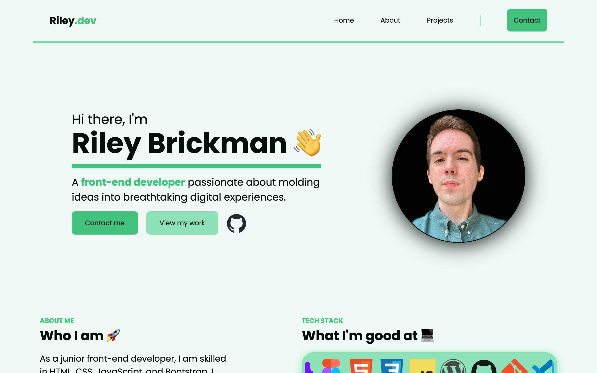

# Portfolio Website

My current portfolio website built in HTML, CSS, and JavaScript

## Purpose &#127919;
This website serves as my homepage to showcase my front-end skills! It features a full responsive design, sections to showcase my projects, skills, and contact info. Additionally, I have implemented JavaScript features such as a "scroll-to-top" button that reacts to the user scrolling down the page.

## Technologies used &#128640;
This site features HTML, CSS, and vanilla JavaScript. As my skill set continues to expand, I will be implementing new features, optimizations, and frameworks. 

## Attributions &#128226;

- Icons for the tech stack section are from [DEVICON](https://https://devicon.dev/).
- "Poppins" font from [Google Fonts](https://fonts.google.com/specimen/Poppins).
